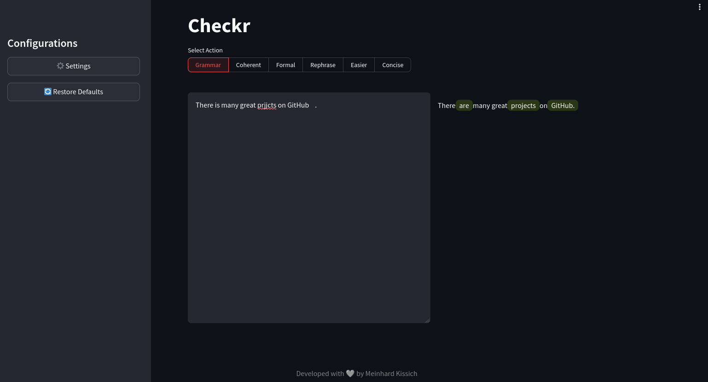

# Checkr



Checkr is a minimalistic UI for grammar correction and text improvements with self-hosted LLMs.

## 🚀 Quickstart

You can run the application in a Docker container using the provided `docker-compose.yml` file or run it natively.

Clone the repo.

```shell
https://github.com/meiniKi/Checkr.git
```

### Docker

Make sure all necessary drivers and NVIDIA/CUDA tools are installed on your system. You may want to take a look at [this](https://docs.nvidia.com/datacenter/cloud-native/container-toolkit/latest/install-guide.html#installing-the-nvidia-container-toolkit) and [this](https://developer.nvidia.com/cuda-downloads) pages. Then, restart the docker.

```bash
sudo apt install -y nvidia-cuda-toolkit
sudo apt install -y nvidia-open
sudo systemctl restart docker
```

You can build the containers and start them.

```bash
docker compose up --build -d
```

To rebuild the contains, use:
```bash
docker compose up --build --force-recreate  -d 
```

You can now access the Web UI via `0.0.0.0:8501`, i.e., the `<IP>:8501` if you are accessing remotely.

### Native Installation

Create a virtual environment, activate it, and install the requirements.

```shell
cd <repo path>
python3.10 -m venv .venv
source .venv/bin/activate
pip install -r requirements.txt
```

Start the application.
```shell
streamlit run app.py
```

You should now be able to access the Web UI via IP and port.
